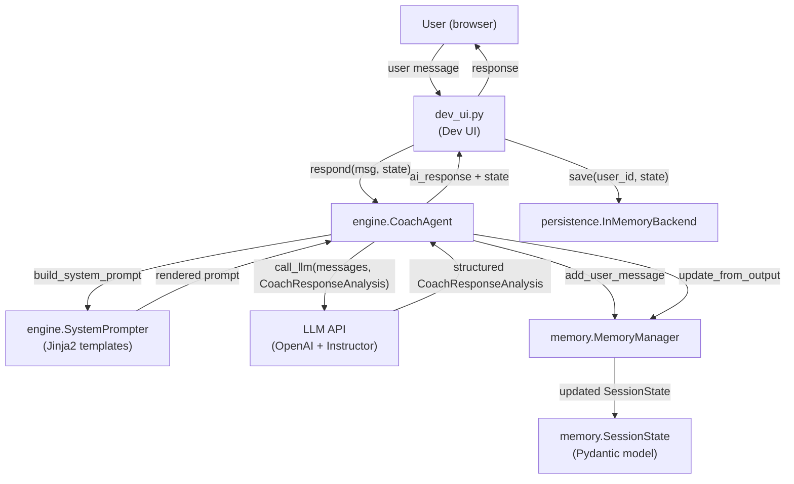
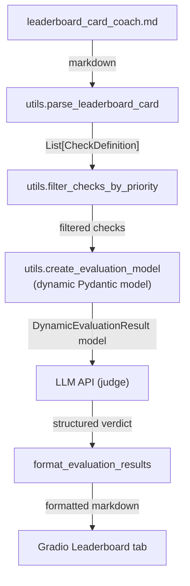

# Life Coach System

An AI-powered life coaching application with a Gradio web UI. The coach conducts structured coaching conversations using an OpenAI-compatible LLM with Instructor for structured output (Chain of Thought via Pydantic models). Supports multiple users with independent per-user session state and includes an LLM-as-Judge evaluation system against 14 leaderboard criteria.

---

## Architecture

### Message flow



### Evaluation flow



### Diagram narrative

**Message flow:** The user sends a message through the dev UI (`dev_ui.py`). `CoachAgent.respond()` first adds the message to the conversation history via `MemoryManager`, then builds a Jinja2 system prompt with current session context. The prompt and recent history are sent to the LLM via `call_llm()`, which returns a structured `CoachResponseAnalysis` model (Chain of Thought enforced). `MemoryManager.update_from_output()` maps the structured response back into `SessionState` (phase, emotions, question counters). The final text response and updated state are returned to the UI, which persists the state.

**Evaluation flow:** The user triggers evaluation in the Leaderboard tab. `parse_leaderboard_card()` reads the 14 criteria from the markdown file; `filter_checks_by_priority()` narrows the list. `create_evaluation_model()` dynamically builds a Pydantic model with two fields per criterion (`{id}_reasoning` + `{id}_passed`). The judge LLM evaluates the conversation against all criteria and returns a structured verdict, which is formatted as markdown for display.

---

## How to run

### Client UI (FastAPI + React)

```bash
# 1. Build the frontend (one-time, or after frontend changes)
cd frontend && npm install && npm run build && cd ..

# 2. Start the API server (serves both API and built frontend)
uv run life-coach-api
```

The app is available at `http://localhost:8000`.

#### Frontend development

For hot-reload during frontend work, run the API and Vite dev server separately:

```bash
# Terminal 1 — API backend
uv run life-coach-api

# Terminal 2 — Vite dev server (proxies /api to :8000)
cd frontend && npm run dev
```

The Vite dev server runs at `http://localhost:5173`.

### Dev UI (Gradio)

```bash
uv run python dev_ui.py
```

The Gradio dev UI starts at `http://0.0.0.0:8080`. This is a development/testing interface — uses in-memory state and exposes evaluation tooling. Not for production use.

### Tests

```bash
uv run pytest
```

### Linting and formatting

```bash
uv run ruff check src/ && uv run ruff format --check src/
```

---

## Configuration

Copy `.env.example` to `.env` and fill in your credentials:

```bash
cp .env.example .env
```

Key variables:

| Variable | Description |
|---|---|
| `OPENAI_API_KEY` | API key for your OpenAI-compatible endpoint |
| `OPENAI_BASE_URL` | Base URL of the LLM API |
| `MODEL_NAME` | Full model identifier (e.g. `gpt-4o-mini-2024-07-18`) |
| `DEBUG` | Set to `false` in production for JSON logging |
